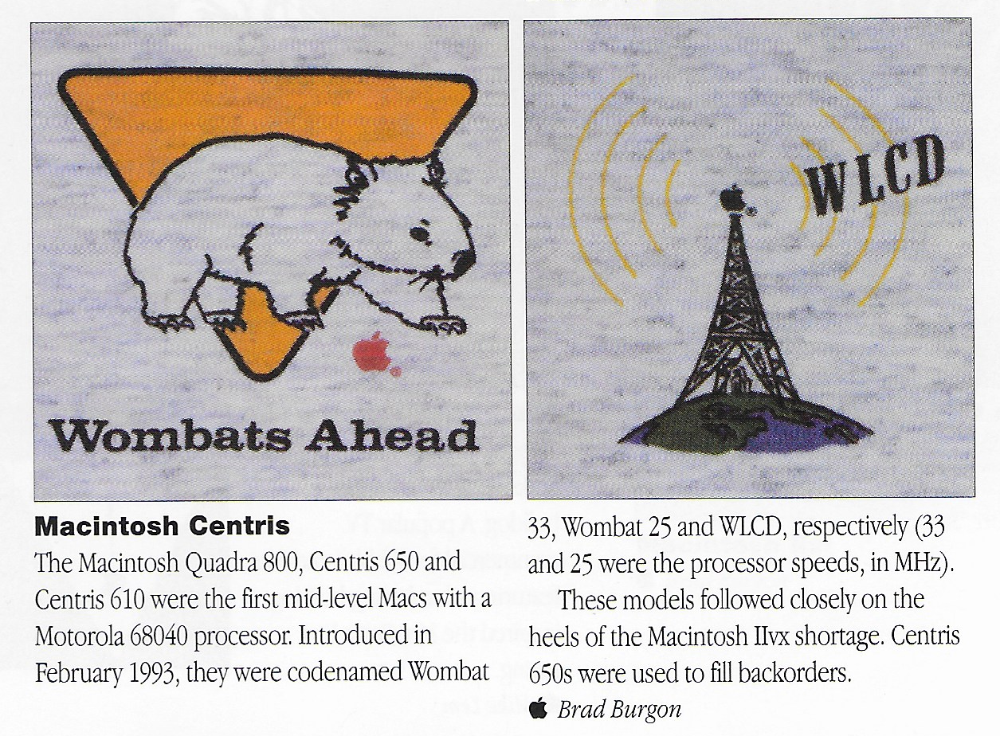

wombat-hacks
============
This is a repository for information and code to push the capabilities of the codename "Wombat" machines (the Centris 650, Quadra 650, and Quadra 800) as far as possible.

Main project goals:
* stable and functional overclock beyond 40 MHz
* detecting and configuring 64MB and 128MB RAM SIMMs

Current status:
* Overclock to 50MHz (but without functional serial and network, and eventual video glitches)
* Maximum RAM up to 8MB + 3x 128MB, with some limits and issues

To squeeze everything out of these machines, you will need to:
* change the configuration resistors on the back of the mobo
* swap in a nicer 68040 chip, the later the better
* apply a faster clock (solder on a faster oscillator or get a MacClip)
* solder in a ROM socket (part number 650473-5)
* get a programmable ROM and burn one of my (cy384's) modified ROM images to it
* probably add a better heatsink, maybe with a fan, to the CPU

terminology and machines
------------------------
Apple used a lot of internal codenames, a few relevant ones here:

* Wombat: the motherboard used in the C650, Q650, and Q800
* djMEMC: the memory controller used on the Wombat macs
* speedbump: after the release of the C650, Q650, and the Q800, faster ("speedbump") versions were under development, up to 40MHz, but mostly not released
* plastics or package: case model
* Frigidaire or fridge: the Q800 case
* Lego: C650 and Q650 case
* WLCD: C610 and Q610 case

From "Universal.a", some of the supported machines by the final 68k ROM (post-dating the ROM versions that shipped with any Wombats) are:

* "33MHz Frigidaire package (Quadra 800)" gestalt ID 35
* "40MHz Frigidaire package (unreleased)" gestalt ID 59?
* "20MHz WLCD (Centris 610)" gestalt ID 52
* "25MHz WLCD (Quadra 610)" gestalt ID 53
* "33MHz WLCD (unreleased)" gestalt ID 63?
* "25MHz Lego package (Centris 650)" gestalt ID 30
* "33MHz Lego package (Quadra 650)" gestalt ID 36
* "40MHz Lego package (Quadra 650 SpeedBump, unreleased)" gestalt ID 51?

Based on jumper and resistor placement, a Wombat can report being a 30, 35, 36, 51, or 59.  Note that early versions of Mac OS 7 don't support all of these!  I believe 7.5.3 does.

oscillator-socket
-----------------
Pictures describing how I added a socket to my Wombat board, for easy oscillator swapping.  Takes standard 'full size' DIP14 5V oscillators.

ultra-wombat-hax-tool
---------------------
This is a simple program that reads and pretty-prints data from the djmemc memory controller registers.  Useful for figuring out how the ROM is configuring the machine.

rom-hacking
-----------
A tiny, lazy pile of hacks to modify and build a Wombat ROM.  There are a few partially disassembled ROMs, with changes to allow overclocking and RAM increases.

external docs
-------------
Reference copies of various useful documents and notes.

stock roms
----------
Reference copies of the two Wombat ROMs I'm aware of: checksum F1A6F343 (Centris 650?) and F1ACAD13 (Quadra 650, Quadra 800?).  Supposedly these were also used for the Centris/Quadra 610 machines.
